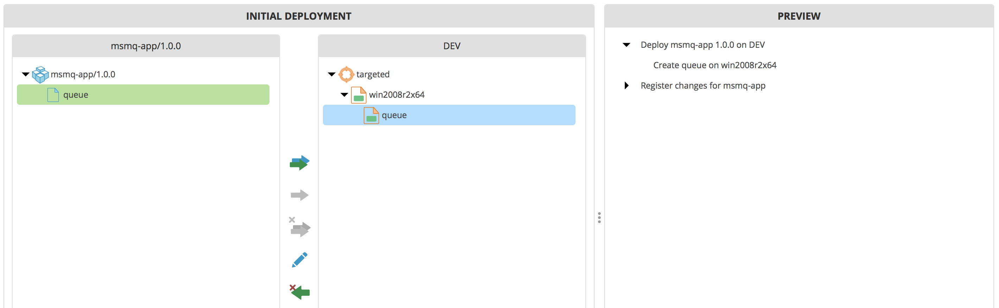
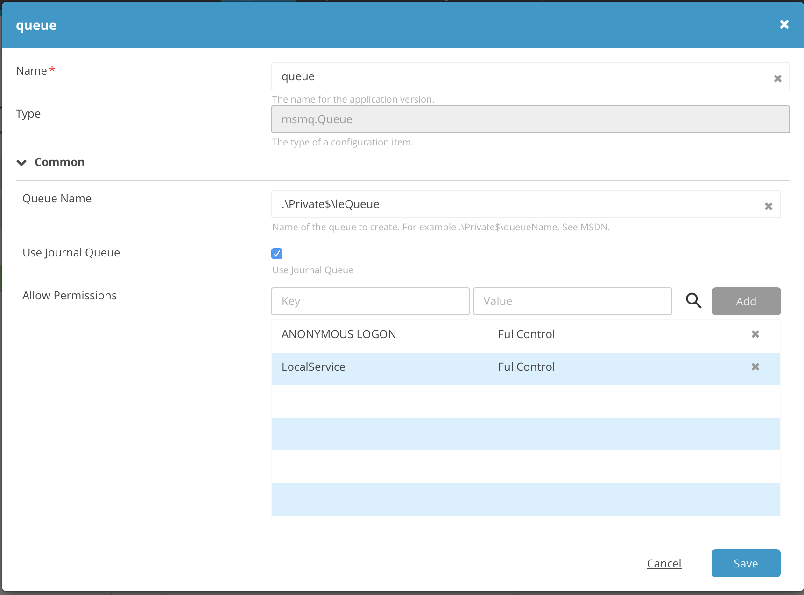
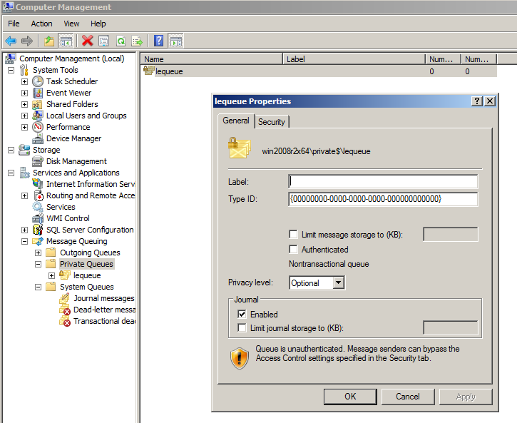
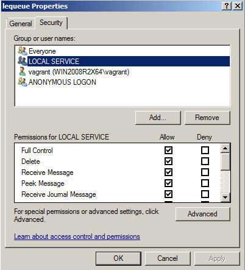

# xld-msmq-plugin

# Introduction

The plugin allows you to define include MSM(Q) Queues Specs in your deployment packages which can deploy to Windows Server environments. 

# Usage

Download the latest plugin from `release` and upload the xldp file to the `XL_DEPLOY_HOME/plugins` directory.

A deployment will look like this:

The deployed (queue specification) looks like this:

After deployment this package will create the queue in Windows as such:

# Testing

In order to run this, you should have access to a Windows Server environment with MSMQ installed on it. See [this](https://msdn.microsoft.com/en-us/library/aa967729(v=vs.85\).aspx) installation guide on how to install MSMQ to a Windows machine.

By running `./gradlew runDocker` an XL Deploy instance (find the port number in build.gradle, currenlty `4517`) is started with an example setup, expecting a Windows Server on `192.168.56.123`.